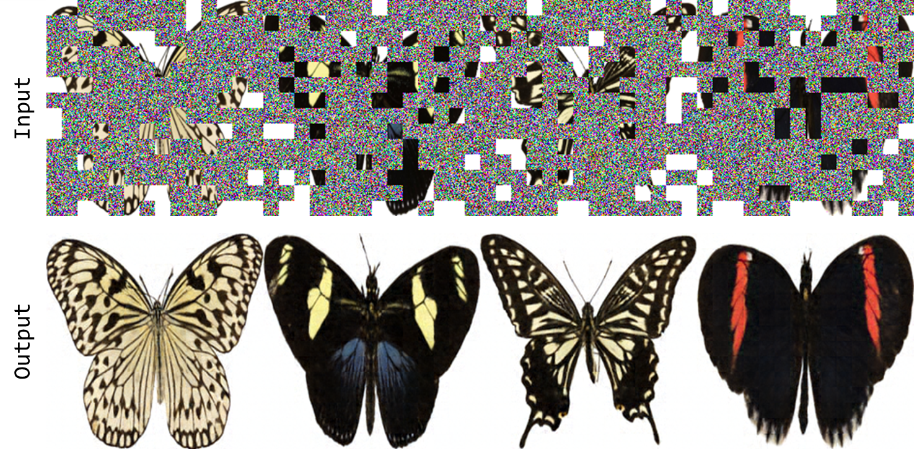

# [*Diffusion Models as Masked Autoencoders (ICCV 2023)*](https://openaccess.thecvf.com/content/ICCV2023/papers/Wei_Diffusion_Models_as_Masked_Autoencoders_ICCV_2023_paper.pdf)


## Installation
```
pip install -r requirements.txt
```

## Setup
```
cd diffusers
pip install -e ".[torch]"
```
```
cd transformers
pip install -e ".[torch]"
```

## Dataset (smithsonian_butterflies_subset)
https://huggingface.co/datasets/huggan/smithsonian_butterflies_subset

## Run
```
python main_diffmae.py
```

## Results
See logs by `tensorboard --logdir logs`.

Pretrained models are in [Google drive](https://drive.google.com/file/d/155iNeXy5yDL5ClXBhTT0lmJgeKQ7dVVo/view?usp=drive_link) (Butterfly).

Pretrained models are in [Google drive](https://drive.google.com/file/d/1vqN8mfKLfRJwa0P0xNnNpNAgerERnGMJ/view?usp=drive_link) (Hair map).

Visualization of the first 4 images on 'smithsonian_butterflies_subset' dataset:


